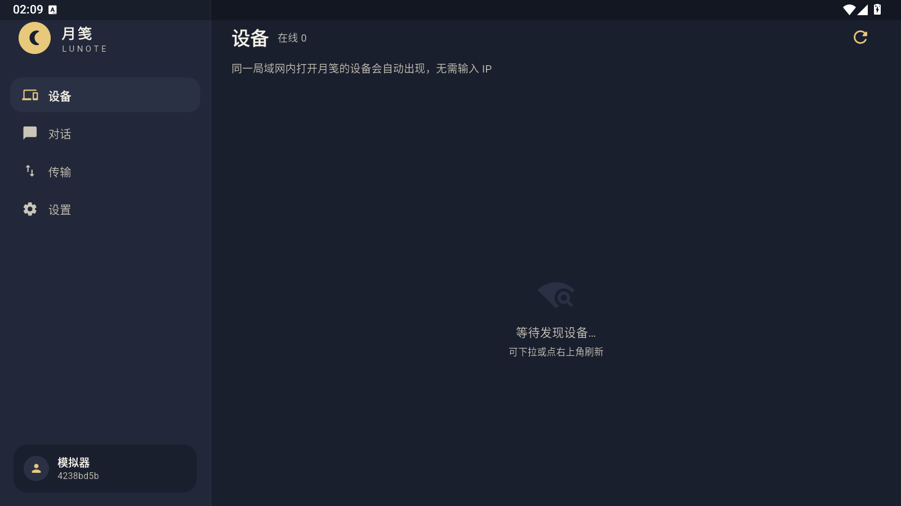
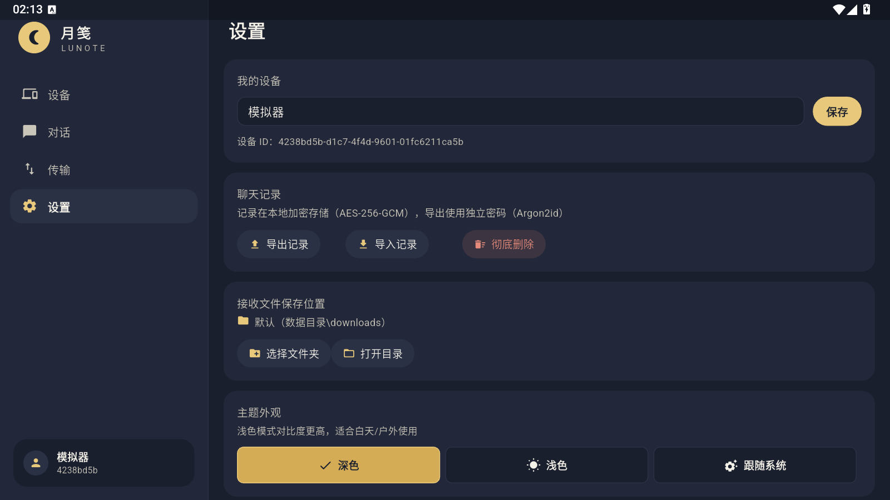
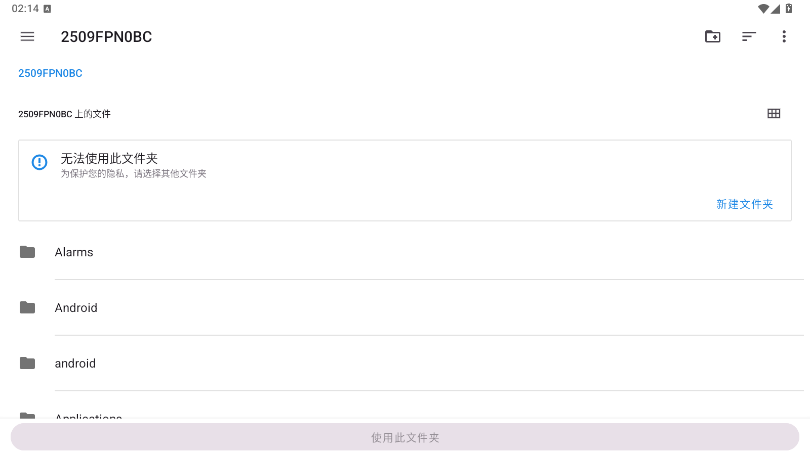

# Lunote

A cloudless, account-free local messaging and file transfer application for Android, Windows 10+, and Linux.

## Highlights

- Direct LAN, virtual-LAN, and manually addressed connections
- TLS 1.3 sessions with device identity, trust confirmation, and encrypted local records
- Text, links, files, folders, multi-file sharing, previews, and system share integration
- Chunked transfers with SHA-256 verification, cancellation, retry, and resumable transfers after interruption
- Transfer speed, estimated remaining time, progress animation, and transfer history
- Persistent settings, light/dark/system themes, device management, and diagnostic logs
- Android Storage Access Framework support for selecting folders such as `Download`
- Synchronized collision policies (rename, overwrite, or skip) and a diagnostics panel with ports, peers, discovery counters, and transfer directories
- Optional PIN app lock that re-locks when the app returns from background; only a SHA-256 digest is persisted

## Build

The Flutter application is under `app/`. The Rust core and FFI bridge are under `crates/`.

```powershell
$env:CI='true'
flutter analyze --no-pub
flutter build apk --release --no-pub
```

The current Android application version is **1.2.0 (3)**. The application id and signing configuration remain unchanged so release APKs can be updated in place.

## Privacy and security

Lunote has no cloud relay and no account service. Message contents are stored in an encrypted local database. Files are transferred directly between trusted devices. Network discovery broadcasts device metadata only; message and file contents use the authenticated encrypted session.

See `docs/协议.md`, `docs/安全模型.md`, and `docs/交付报告.md` for the protocol, security model, and verification history.

## Screenshots

### Android







### Windows


## Release

Use tools/publish_github_release.ps1 to verify and upload the tagged APK and release notes after running gh auth login.
