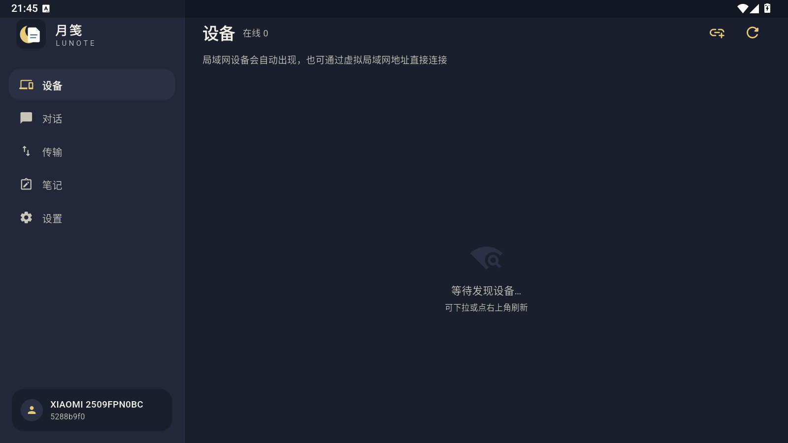
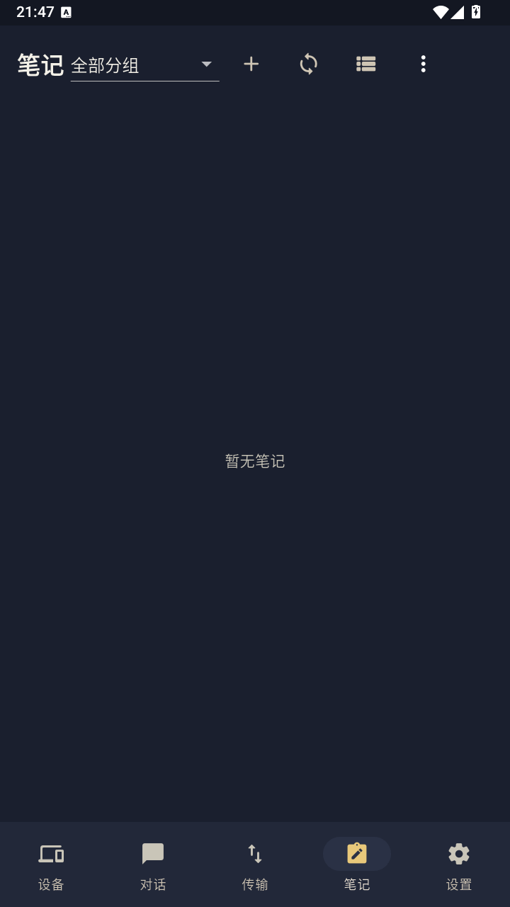
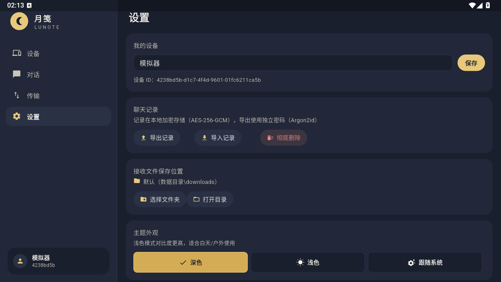
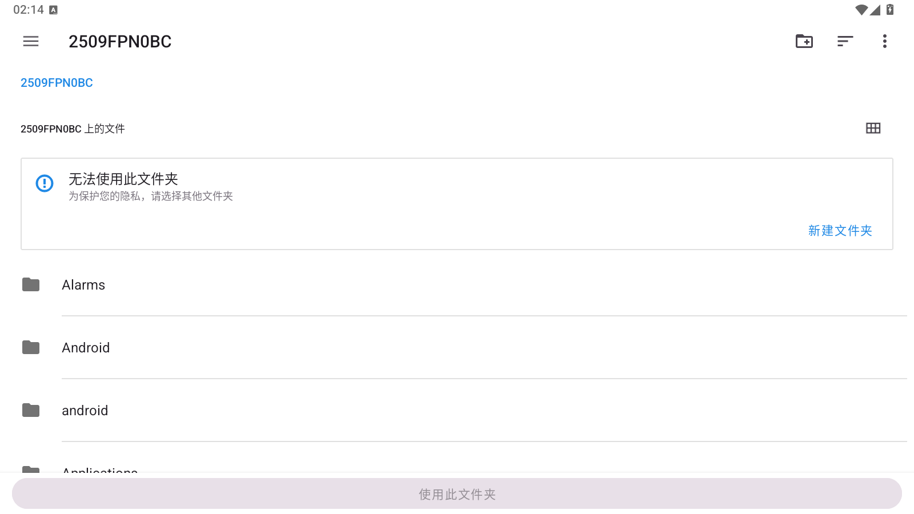
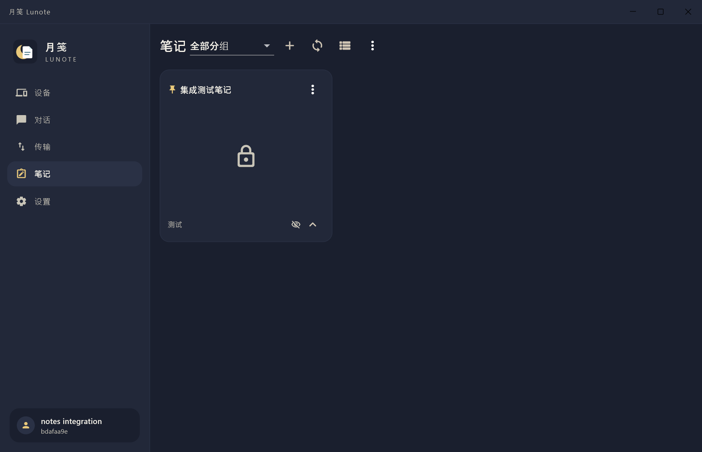

# Lunote

## Version 2.0.0

Lunote is a serverless LAN messenger and file transfer tool for Android and Windows. This release adds encrypted offline message delivery, independent temporary conversations, selected-device encrypted notes sync, square note cards with privacy blur, full-message actions, and Windows installer/portable/ZIP packages.

The Android application ID and signing configuration remain unchanged so an existing APK can be upgraded in place. The new protocol requires both endpoints to run 2.0.0 for offline messages, temporary conversations, and notes synchronization. File transfer remains compatible with the existing trusted-device flow.

Validation: 4 Rust bridge tests, 28 core tests, 15 real-socket E2E tests, 8 Flutter widget tests, and Flutter analysis passed. Real Windows and LDPlayer Android integration tests cover password-protected notes and restart persistence. Windows-to-Android interoperability verifies bidirectional encrypted note editing, isolated temporary chat messages, and byte-for-byte integrity of a 4 MiB file. Physical-device fingerprint authentication remains unverified.

A cloudless, account-free local messaging and file transfer application for Android, Windows 10+, and Linux.

## Highlights

- Direct LAN, virtual-LAN, and manually addressed connections
- TLS 1.3 sessions with device identity, trust confirmation, and encrypted local records
- Text, links, files, folders, multi-file sharing, previews, and system share integration
- Chunked transfers with SHA-256 verification, cancellation, retry, and resumable transfers after interruption
- Transfer speed, estimated remaining time, progress animation, and transfer history
- Persistent settings, light/dark/system themes, device management, and diagnostic logs
- Android Storage Access Framework support for selecting folders such as `Download`
- Synchronized collision policies (rename, overwrite, or skip) and a diagnostics panel with ports, peers, discovery counters, and transfer directories
- Optional PIN app lock that re-locks when the app returns from background; only a SHA-256 digest is persisted

## Build

The Flutter application is under `app/`. The Rust core and FFI bridge are under `crates/`.

```powershell
$env:CI='true'
$env:LUNOTE_SIGNING_KEYSTORE='C:/path/to/the-existing-publishing-key.keystore'
flutter analyze --no-pub
flutter build apk --release
```

The current Android application version is **2.0.0 (15)**. The application ID is `com.lunote.lunote_app`. The APK certificate SHA-256 is `41a125c42c4a6b466da9bdfff237771cc2a1b213560c175472156a5b85bbcdae`, matching the existing 1.5.7 APK. Release builds require the existing publishing key; private keys must never be committed.

## Privacy and security

Lunote has no cloud relay and no account service. Message contents are stored in an encrypted local database. Files are transferred directly between trusted devices. Network discovery broadcasts device metadata only; message and file contents use the authenticated encrypted session.

See `docs/协议.md`, `docs/安全模型.md`, and `docs/交付报告.md` for the protocol, security model, and verification history.

## Screenshots

### Android









### Windows




## Release

Use `tools/publish_github_release.ps1` to upload the tagged APK, Windows installer, single-file portable EXE, complete ZIP, release notes, and SHA-256 checksums after running `gh auth login`. The portable EXE runs directly without manual installation or extraction and without a visible console window.

Version 2.0.0 is completing release verification. Published downloads are available on the [Releases page](https://github.com/OPFIMISS/--Lunote/releases).

## 2.0 Behavior

- Offline messages are queued on the sender. With no server, delivery requires both endpoints to be online at the same time; restarting the sender retains the queue. Delivered means durably saved by the receiver, not read.
- Temporary conversations are independent on both endpoints. Local deletion hides only the local history; deletion for both endpoints propagates when reconnected. Downloaded files are retained unless explicitly selected for local deletion.
- Each device selects its trusted note-sync peers once. Selected endpoints synchronize continuously when connected, including changes made offline. Concurrent changes retain a conflict copy rather than silently overwriting content.
- Note passwords protect the synchronized content, not the visible title. Each device initially enters the same note password independently; Android may then opt into local biometric or screen-lock authentication. Passwords are never synchronized in plaintext.
- Gaussian blur is a low-privacy visual shield, not encryption. Double-tap reveals shielded content; leaving the notes page or backgrounding the app hides it again.
